# github-profile-crt

Generate a CRT-style SVG chart from your GitHub contribution calendar and use it in your profile README.

## Stack

- TypeScript
- pnpm
- Vite (build)
- GitHub GraphQL API

## Project structure

- `src/config` - environment loading and typed runtime config
- `src/github` - GraphQL query + GitHub client + calendar fetcher
- `src/model` - contribution calendar domain types and derived weekly stats
- `src/render` - palette, layout, SVG path helpers, and final renderer
- `src/generator.ts` - orchestration for fetch + render + file write
- `src/cli.ts` - executable entry point for local runs and CI

## Setup

```bash
pnpm install
```

Create `.env` (or set GitHub Secrets in Actions):

```env
GH_TOKEN=ghp_xxx
GITHUB_USER=your-github-username
CRT_THEME=crt
CRT_OUTPUT_PATH=assets/crt-contributions.svg
```

## Generate SVG locally

```bash
pnpm generate
```

This builds the project with Vite and writes the SVG to `assets/crt-contributions.svg` by default.

For local dev (run TypeScript directly, no build):

```bash
pnpm dev
```

## GitHub Actions workflow

A ready workflow is included at:

- `.github/workflows/generate-crt-contributions.yml`

It can run on schedule and manual trigger, then commit updated SVG output back to the repo.

### Recommended repository settings

- Add `GH_TOKEN` secret (classic PAT with `read:user` + `repo`)
- Optional repo variable `GITHUB_USER` to target a specific profile
- Optional repo variable `CRT_THEME` (`crt` or `amber`)

## SVG in profile README

```md

```
