# github-profile-crt

CRT-style GitHub contribution visualizer for profile READMEs.

Turn the default contribution chart into an animated retro signal board with theme presets, light/dark variants, and GitHub Actions automation.

<p align="center">
  <picture>
    <source media="(prefers-color-scheme: dark)" srcset="./assets/crt-dark.svg">
    <source media="(prefers-color-scheme: light)" srcset="./assets/crt-light.svg">
    
  </picture>
</p>

<p align="center">
  <a href="https://github.com/stefashkaa/github-profile-crt/actions/workflows/generate-crt-contributions.yml"></a>
  <a href="https://github.com/stefashkaa/github-profile-crt/stargazers"></a>
  <a href="./LICENSE"></a>
  <a href="https://github.com/stefashkaa/github-profile-crt/issues"></a>
</p>

## Why This Project

Most GitHub profile charts look similar. `github-profile-crt` is built to stand out.

- Animated CRT/equalizer visuals with personality
- 12+ presets generated in a single run
- Light and dark variants for profile theme compatibility
- Optional dashboard widgets for activity and language profile
- Ready-to-run GitHub workflow for auto-updated SVGs

## Quick Start

### 1. Install

```bash
pnpm install
```

### 2. Configure

```bash
cp .env.example .env
```

Set at least:

```env
GITHUB_TOKEN=ghp_xxx
GITHUB_USER=your-github-username
```

### 3. Generate

```bash
pnpm generate:dev
```

Generated SVGs are saved to `assets/`.

## Add To Profile README

```md
<p align="center">
  <picture>
    <source media="(prefers-color-scheme: dark)" srcset="./assets/crt-dark.svg">
    <source media="(prefers-color-scheme: light)" srcset="./assets/crt-light.svg">
    
  </picture>
</p>
```

## Theme Preview

<p align="center">
  
  
</p>

<p align="center">
  
  
</p>

## Themes

Presets:

- `crt`
- `amber`
- `ice`
- `ruby`
- `mint`
- `mono`
- `winamp`
- `neon`
- `rainbow`
- `chaos`
- `chaos-max`
- `static`

Theme selection:

- `CRT_THEMES=all` generates all presets
- `CRT_THEMES=neon,rainbow,crt` generates selected presets
- `CRT_THEMES=custom` generates your custom palette theme

## Key Configuration

| Variable                 | Default      | Description                                           |
| ------------------------ | ------------ | ----------------------------------------------------- |
| `CRT_THEMES`             | `all`        | Theme set to generate                                 |
| `CRT_SHOW_GRID`          | `true`       | Show main chart grid                                  |
| `CRT_SHOW_STATS`         | `true`       | Show dashboard widgets                                |
| `CRT_SHOW_STATS_FOOTER`  | `true`       | Show footer stats row                                 |
| `CRT_ENABLE_HOVER_ATTRS` | `false`      | Include per-bar `<title>` hover metadata              |
| `CRT_MINIFY_SVG`         | `true`       | Optimize SVG output                                   |
| `CRT_YEAR`               | current year | Current year = rolling 12 months, past year = Jan-Dec |

Custom palette envs are supported via `CRT_CUSTOM_*` and `CRT_CUSTOM_LIGHT_*` values.

## Data Window Behavior

- `CRT_YEAR=<current year>` or unset:
  rolling range from current month of previous year to current month now
- `CRT_YEAR=<past year>`:
  fixed Jan-Dec of selected year
- `LAST WEEK` footer stat is hidden for past-year fixed ranges

## GitHub Actions Automation

Included workflow:

- [`.github/workflows/generate-crt-contributions.yml`](./.github/workflows/generate-crt-contributions.yml)

It runs on schedule and manual dispatch, generates SVGs, and auto-commits changed files in `assets/`.

## Local Development

```bash
pnpm lint
pnpm typecheck
pnpm generate:dev
```

Quality tools:

- ESLint
- Prettier
- Husky
- lint-staged

`pre-commit` runs `pnpm lint-staged`.

## Project Structure

- `src/config` runtime and env parsing
- `src/github` GitHub GraphQL client and data fetchers
- `src/model` shared data models
- `src/render/themes.ts` theme presets and variants
- `src/render/svgRenderer.ts` SVG renderer
- `src/generator.ts` orchestration and output
- `src/cli.ts` command entry point

## Open Source Docs

- [Contributing Guide](./CONTRIBUTING.md)
- [Code of Conduct](./CODE_OF_CONDUCT.md)
- [Security Policy](./SECURITY.md)
- [Support](./SUPPORT.md)
- [Changelog](./CHANGELOG.md)

## Credits

Built by [@stefashkaa](https://github.com/stefashkaa).

If this project helps your profile stand out, star the repo and share your theme setup.

## License

[MIT](./LICENSE)
