# github-profile-crt

CRT-style GitHub contribution visualizer for profile READMEs.

Turn the default contribution chart into an animated retro signal board with theme presets, light/dark variants, and GitHub Actions automation.

<p align="center">
  <picture>
    <source media="(prefers-color-scheme: dark)" srcset="./assets/crt-dark.svg">
    <source media="(prefers-color-scheme: light)" srcset="./assets/crt-light.svg">
    
  </picture>
</p>

<p align="center">
  <a href="https://github.com/stefashkaa/github-profile-crt/actions/workflows/generate-crt-contributions.yml"></a>
  <a href="https://github.com/stefashkaa/github-profile-crt/stargazers"></a>
  <a href="./LICENSE"></a>
  <a href="https://github.com/stefashkaa/github-profile-crt/issues"></a>
</p>

## Why This Project

Most GitHub profile charts look similar. `github-profile-crt` is built to stand out.

- Animated CRT/equalizer visuals with personality
- 12+ presets generated in a single run
- Light and dark variants for profile theme compatibility
- Optional dashboard widgets for activity and language profile
- Ready-to-run GitHub workflow for auto-updated SVGs

## Quick Start

1. Create or open your GitHub profile repository.

For user profile READMEs, use `<username>/.github`.

For organization profile READMEs, use `<organization>/.github`.

For project repos, it can be any repo you want to showcase the chart in. You can also use this action in non-profile repos by setting `github-user`.

2. Create workflow folders in the repo root:

```text
.github/workflows
```

3. Create a file:

```text
.github/workflows/generate-crt-contributions.yml
```

4. Paste this workflow:

```yaml
name: Generate CRT Contributions

on:
  workflow_dispatch:
  schedule:
    - cron: '15 */12 * * *' # Runs every 12 hours (UTC). Adjust cadence if needed.

permissions:
  contents: write # Required so the action can commit and push updated SVG files.

jobs:
  generate:
    runs-on: ubuntu-latest
    steps:
      - name: Generate SVG assets
        uses: stefashkaa/github-profile-crt@v1
        with:
          output-dir: assets # Where SVGs will be written.
          themes: crt # Supports: all | comma-separated presets | custom.
```

Defaults handled automatically:

- `github-user` defaults to `github.repository_owner` (works for both user and org owners)
- `github-token` defaults to `github.token`
- `commit-and-push` defaults to `true`
- `year` defaults to current year (rolling 12 months)
- `themes` defaults to `crt`
- `show-grid`, `show-stats`, `show-stats-footer`, and `minify-svg` default to `true`
- `include-org-private` defaults to `false`

Account modes:

- If `github-user` is a user login, data comes from GitHub user contributions collection.
- If `github-user` is an organization login, data is aggregated from organization repositories visible to the provided token (`public` by default, `all` when `include-org-private: 'true'`).

5. Commit the workflow file.
   After commit, run it once from GitHub UI:
   `Actions -> Generate CRT Contributions -> Run workflow`.

The action will generate/update SVG files in `assets/` and push them automatically.

6. Create /profile/README.md if it doesn't exist, or edit your existing markdown file to include the generated SVGs:

```md
<p align="center">
  <picture>
    <source media="(prefers-color-scheme: dark)" srcset="../assets/crt-dark.svg">
    <source media="(prefers-color-scheme: light)" srcset="../assets/crt-light.svg">
    
  </picture>
</p>
```

The `picture` element ensures the correct theme variant is shown based on user preference. Adjust paths if your SVGs are in a different location.

## Themes

- [crt](./docs/crt.md)
- [amber](./docs/amber.md)
- [ice](./docs/ice.md)
- [ruby](./docs/ruby.md)
- [mint](./docs/mint.md)
- [mono](./docs/mono.md)
- [winamp](./docs/winamp.md)
- [neon](./docs/neon.md)
- [rainbow](./docs/rainbow.md)
- [chaos](./docs/chaos.md)
- [chaos-max](./docs/chaos-max.md)
- [static](./docs/static.md)

Set `themes` in workflow input:

- `themes: all` generates all presets
- `themes: neon,rainbow,crt` generates selected presets
- `themes: rainbow` generates the rainbow preset
- `themes: custom` generates your custom palette theme

## Customize Theme

To build a custom palette, set `themes: custom` and pass supported `CRT_CUSTOM_*` values via workflow `env`.

Example:

```yaml
jobs:
  generate:
    runs-on: ubuntu-latest
    steps:
      - uses: stefashkaa/github-profile-crt@v1
        with:
          output-dir: assets
          themes: custom
        env:
          CRT_CUSTOM_BASE_THEME: crt
          CRT_CUSTOM_SPECTRUM_CHART: 'true'
          CRT_CUSTOM_BG0: '#02060f'
          CRT_CUSTOM_BG1: '#06182a'
          CRT_CUSTOM_BG2: '#0c2d42'
          CRT_CUSTOM_PRIMARY: '#5fffb1'
          CRT_CUSTOM_PRIMARY_SOFT: '#84ffc4'
          CRT_CUSTOM_TEXT_DIM: '#8fd1aa'
          CRT_CUSTOM_SCAN: '#2fff7f'
          CRT_CUSTOM_ENABLE_LIGHT: 'true'
          CRT_CUSTOM_LIGHT_BG0: '#eefaf2'
          CRT_CUSTOM_LIGHT_BG1: '#e2f4e9'
          CRT_CUSTOM_LIGHT_BG2: '#d0eadf'
          CRT_CUSTOM_LIGHT_PRIMARY: '#2a9f65'
          CRT_CUSTOM_LIGHT_PRIMARY_SOFT: '#62ba8a'
          CRT_CUSTOM_LIGHT_TEXT_DIM: '#557d67'
          CRT_CUSTOM_LIGHT_SCAN: '#62ba8a'
```

Supported custom keys:

- `CRT_CUSTOM_BASE_THEME`
- `CRT_CUSTOM_SPECTRUM_CHART`
- `CRT_CUSTOM_BG0`, `CRT_CUSTOM_BG1`, `CRT_CUSTOM_BG2`
- `CRT_CUSTOM_PRIMARY`, `CRT_CUSTOM_PRIMARY_SOFT`
- `CRT_CUSTOM_TEXT_DIM`, `CRT_CUSTOM_SCAN`
- `CRT_CUSTOM_ENABLE_LIGHT`
- `CRT_CUSTOM_LIGHT_BG0`, `CRT_CUSTOM_LIGHT_BG1`, `CRT_CUSTOM_LIGHT_BG2`
- `CRT_CUSTOM_LIGHT_PRIMARY`, `CRT_CUSTOM_LIGHT_PRIMARY_SOFT`
- `CRT_CUSTOM_LIGHT_TEXT_DIM`, `CRT_CUSTOM_LIGHT_SCAN`

## Open Source Docs

- [Contributing Guide](./CONTRIBUTING.md)
- [Code of Conduct](./CODE_OF_CONDUCT.md)
- [Security Policy](./SECURITY.md)
- [Support](./SUPPORT.md)
- [Changelog](./CHANGELOG.md)

## Contributing

PRs are welcome. For local changes:

```bash
pnpm install
pnpm lint
pnpm typecheck
pnpm generate:dev
```

Pre-commit hooks run `lint-staged`.

## Credits

Built by [@stefashkaa](https://github.com/stefashkaa).

If this project helps your profile stand out, star the repo and share your theme setup.

## License

[MIT](./LICENSE)
