# Chaos Max Theme

<!-- nav:top:start -->

[← Back to README](../README.md)

<!-- nav:top:end -->

Maximum intensity mode with extreme scan/noise dynamics for the wildest animated aesthetic.

## Dark Mode

<p align="center">
  
</p>

## Light Mode

<p align="center">
  
</p>

## Use This Theme

File: .github/workflows/generate-crt-contributions.yml

```yaml
name: Generate CRT Contributions

on:
  workflow_dispatch:
  schedule:
    - cron: '15 */12 * * *'

permissions:
  contents: write

jobs:
  generate:
    runs-on: ubuntu-latest
    steps:
      - name: Generate SVG assets
        uses: stefashkaa/github-profile-crt@v1
        with:
          output-dir: assets
          themes: chaos-max
```

Profile README snippet:

```md
<p align="center">
  <picture>
    <source media="(prefers-color-scheme: dark)" srcset="../assets/chaos-max-dark.svg">
    <source media="(prefers-color-scheme: light)" srcset="../assets/chaos-max-light.svg">
    
  </picture>
</p>
```

<!-- nav:bottom:start -->

[↑ Back to README](../README.md)

<!-- nav:bottom:end -->
