# Customize Your Theme

<!-- nav:top:start -->

[← Back to README](../README.md)

<!-- nav:top:end -->

Custom theme lets you start from a preset and override colours, without editing code.

## Enable

In your workflow:

```yml
with:
  themes: 'custom'
```

## Pick a base preset

Set the base preset via environment:

- `CRT_CUSTOM_BASE_THEME` (default: `crt`)

## Palette overrides

Override any subset of:

- `BG0`, `BG1`, `BG2`
- `PRIMARY`, `PRIMARY_SOFT`
- `TEXT_DIM`
- `SCAN`

### What each color controls

- `CRT_CUSTOM_BG0`: Top-left/background start of the main screen gradient.
- `CRT_CUSTOM_BG1`: Mid tone of the main screen gradient and dashboard panel surface tint.
- `CRT_CUSTOM_BG2`: Bottom-right/background end of the main screen gradient.
- `CRT_CUSTOM_PRIMARY`: Main phosphor color for bar side faces, baseline, and key chart strokes.
- `CRT_CUSTOM_PRIMARY_SOFT`: Bright highlight color for bar top faces, pointer caps, and glow accents.
- `CRT_CUSTOM_TEXT_DIM`: Most labels/text (`months`, `footer`, panel titles, small labels, UI separators).
- `CRT_CUSTOM_SCAN`: Animated scanline color.

For light mode, the same mapping applies with `CRT_CUSTOM_LIGHT_*` variables.

Example:

```yml
env:
  CRT_CUSTOM_BASE_THEME: 'mono'
  CRT_CUSTOM_BG0: '#0b0f14'
  CRT_CUSTOM_BG1: '#0f1720'
  CRT_CUSTOM_BG2: '#111c28'
  CRT_CUSTOM_PRIMARY: '#7cffc4'
  CRT_CUSTOM_PRIMARY_SOFT: '#c6ffe6'
  CRT_CUSTOM_TEXT_DIM: '#8ab3a2'
  CRT_CUSTOM_SCAN: 'rgb(124,255,196)'
```

## Light variant control

- `CRT_CUSTOM_ENABLE_LIGHT` — defaults to “on” only if you set any `CRT_CUSTOM_LIGHT_*` overrides
- `CRT_CUSTOM_LIGHT_*` — same palette keys but for light mode

Example:

```yml
env:
  CRT_CUSTOM_ENABLE_LIGHT: 'true'
  CRT_CUSTOM_LIGHT_BG0: '#f6fffb'
  CRT_CUSTOM_LIGHT_BG1: '#e9fff6'
  CRT_CUSTOM_LIGHT_BG2: '#d8f7ea'
```

## Optional spectrum chart

- `CRT_CUSTOM_SPECTRUM_CHART=true` enables rainbow-style colouring.

## Living demo

### Workflow snippet

```yml
- name: Generate Contributions SVGs with Custom Sunset Theme
  uses: stefashkaa/github-profile-crt@v1
  with:
    output-dir: assets
    themes: custom
  env:
    # Base preset
    CRT_CUSTOM_BASE_THEME: 'ruby'
    # Dark mode overrides
    CRT_CUSTOM_BG0: '#15060a'
    CRT_CUSTOM_BG1: '#2a0f16'
    CRT_CUSTOM_BG2: '#3f1a23'
    CRT_CUSTOM_PRIMARY: '#ff7a3d'
    CRT_CUSTOM_PRIMARY_SOFT: '#ffd08a'
    CRT_CUSTOM_TEXT_DIM: '#d9a07f'
    CRT_CUSTOM_SCAN: 'rgb(255,122,61)'
    # Light mode overrides
    CRT_CUSTOM_ENABLE_LIGHT: 'true'
    CRT_CUSTOM_LIGHT_BG0: '#fff4e8'
    CRT_CUSTOM_LIGHT_BG1: '#ffe9d6'
    CRT_CUSTOM_LIGHT_BG2: '#ffd9bf'
    CRT_CUSTOM_LIGHT_PRIMARY: '#c4571f'
    CRT_CUSTOM_LIGHT_PRIMARY_SOFT: '#e2873f'
    CRT_CUSTOM_LIGHT_TEXT_DIM: '#9a5f3a'
    CRT_CUSTOM_LIGHT_SCAN: 'rgb(196,87,31)'
```

### Profile README snippet

```md
<p align="center">
  <picture>
    <source media="(prefers-color-scheme: dark)" srcset="../assets/custom-dark.svg">
    <source media="(prefers-color-scheme: light)" srcset="../assets/custom-light.svg">
    
  </picture>
</p>
```

### Preview (@stefashkaa)

<p align="center">
  <picture>
    <source media="(prefers-color-scheme: dark)" srcset="./img/custom-dark.svg">
    <source media="(prefers-color-scheme: light)" srcset="./img/custom-light.svg">
    
  </picture>
</p>

<!-- nav:bottom:start -->

[↑ Scroll to top](#customize-your-theme)

<!-- nav:bottom:end -->
