# Organization Profile Preview

<!-- nav:top:start -->

[← Back to README](../README.md)

<!-- nav:top:end -->

## Workflow snippet

```yml
- name: Generate Organisation Contributions SVGs
  uses: stefashkaa/github-profile-crt@v1
  with:
    output-dir: assets
    themes: neon
    github-user: DeSource-Labs # Your org account
    github-token: ${{ secrets.ORG_TOKEN }} # Your org token
    include-org-private: true # optional, depends on your needs
    show-stats: false # optional
    show-stats-footer: false # optional
```

`ORG_TOKEN` is a [GitHub token with org data access](./docs/org-token-creation.md).

## Profile README snippet

```md
<p align="center">
  <picture>
    <source media="(prefers-color-scheme: dark)" srcset="../assets/neon-dark.svg">
    <source media="(prefers-color-scheme: light)" srcset="../assets/neon-light.svg">
    
  </picture>
</p>
```

## Preview (DeSource-Labs)

<p align="center">
  <picture>
    <source media="(prefers-color-scheme: dark)" srcset="./img/neon-dark-org.svg">
    <source media="(prefers-color-scheme: light)" srcset="./img/neon-light-org.svg">
    
  </picture>
</p>

<!-- nav:bottom:start -->

[↑ Scroll to top](#organization-profile-preview)

<!-- nav:bottom:end -->
