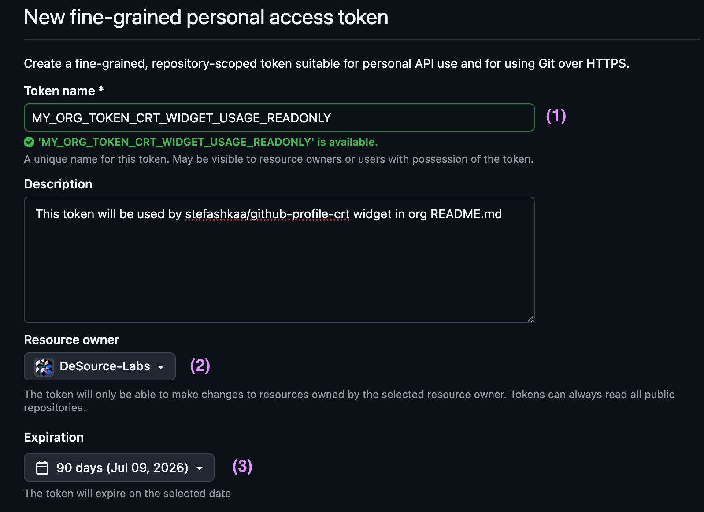
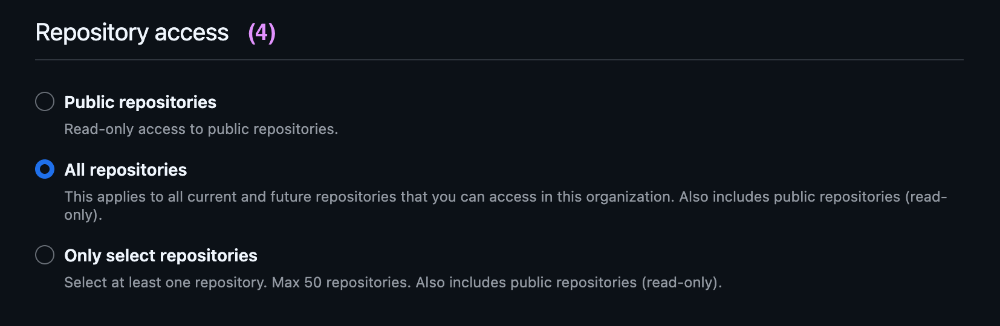
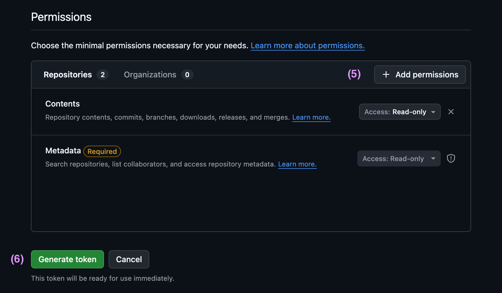
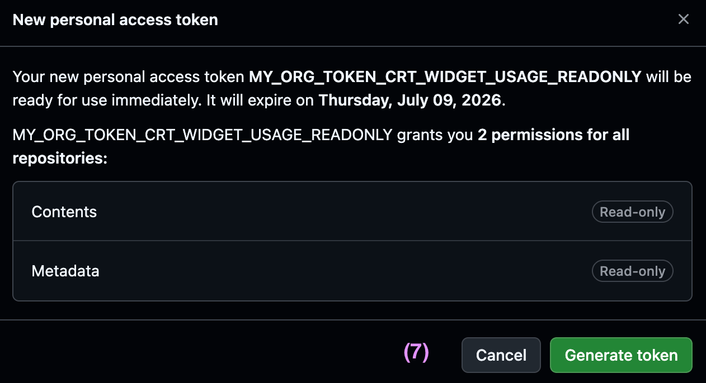
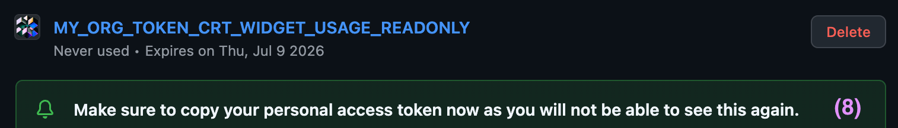
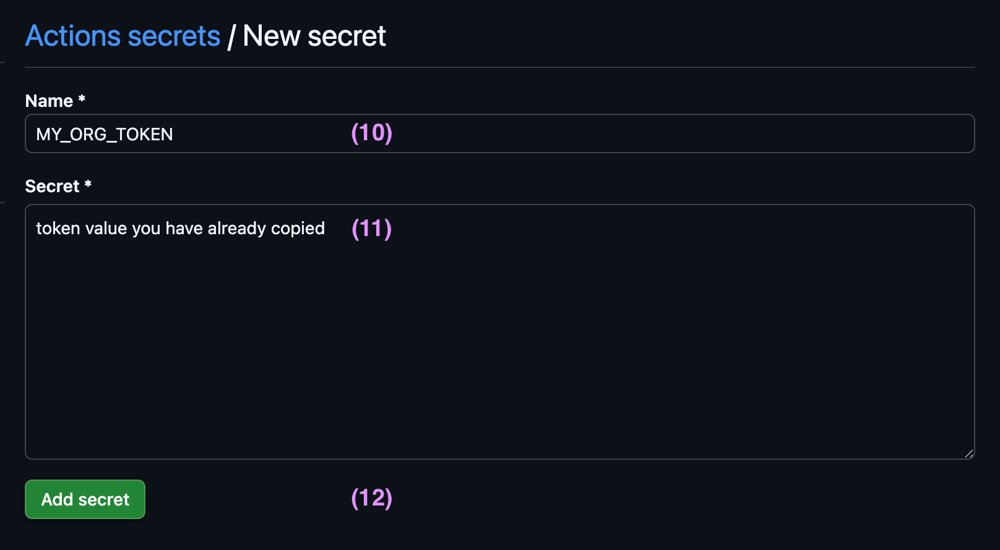

# Creating a GitHub Organization Token

<!-- nav:top:start -->

[← Back to README](../README.md)

<!-- nav:top:end -->

Use an organization-scoped token when you want this action to read contribution data from an organization account.

This is mainly needed for organization profiles, especially if you want to include private organization activity.

## Create the token

1. Open [github.com/settings/personal-access-tokens/new](https://github.com/settings/personal-access-tokens/new) and enter a name such as `github-profile-crt-org-token`
2. In **Resource owner**, select your organization
3. Choose an expiration date

A longer expiration is usually fine here because this token only needs read access.



4. Under **Repository access**, select **All repositories**



5. Click **Add permissions** and select **Contents**

- Keep the default **Read-only** access.
- GitHub should also add **Metadata** with **Read-only** access automatically.

6. Click **Generate token**



7. Review the confirmation dialog and click **Generate token** again



8. Copy the token and save it somewhere secure

You will not be able to view the token again after leaving the page.



## Add the token to GitHub Actions secrets

9. Open `https://github.com/<YOUR_ORG>/.github/settings/secrets/actions/new`
10. In **Name**, enter the secret name you want to use in your workflow, for example `CRT_ORG_TOKEN`
11. In **Secret**, paste the token you copied
12. Click **Add secret**



## Use the token in your workflow

After that, you can reference the secret in your workflow as `${{ secrets.CRT_ORG_TOKEN }}`.

```yml
- name: Generate Organization Contributions SVGs
  uses: stefashkaa/github-profile-crt@v1
  with:
    github-user: DeSource-Labs # Your organization account
    github-token: ${{ secrets.CRT_ORG_TOKEN }} # Token stored in GitHub Actions secrets
    include-org-private: true # Optional: include private org activity when available
```

## Good to know

- `github-user` should be your organization login
- `include-org-private: true` is optional
- Keep this token in GitHub Actions secrets only
- Do not commit token values to the repository

<!-- nav:bottom:start -->

[↑ Scroll to top](#creating-a-github-organization-token)

<!-- nav:bottom:end -->
