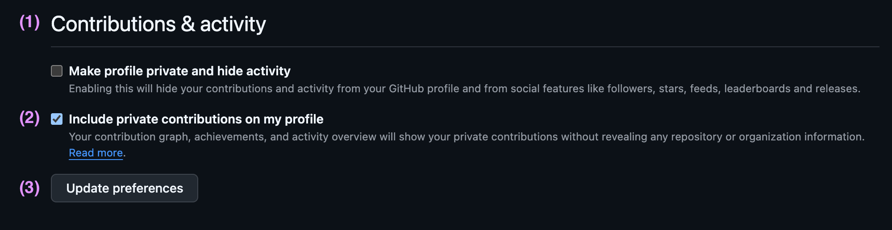

# Including private stats for user profiles

<!-- nav:top:start -->

[← Back to README](../README.md)

<!-- nav:top:end -->

GitHub can show private contributions on your profile without revealing repository names or other private details.

If your chart looks lower than expected, this setting is usually the reason.

## Turn it on

1. Open [github.com/settings/profile](https://github.com/settings/profile)
2. Scroll to **Contributions & activity**
3. Enable **Include private contributions on my profile**
4. Click **Update preferences**

## What this changes

Once enabled, GitHub includes your private contribution count in the profile data used by this project.

Your private repositories and private activity details still stay private.

<!-- nav:bottom:start -->

[↑ Scroll to top](#including-private-stats-for-user-profiles)

<!-- nav:bottom:end -->
