# Mint Theme

<!-- nav:top:start -->

[← Back to README](../../README.md)

<!-- nav:top:end -->

A cleaner, fresher green that keeps the retro soul but feels more modern, lighter, and easier to blend into polished profiles.

## Dark Mode

<p align="center">
  
</p>

## Light Mode

<p align="center">
  
</p>

## Workflow snippet

```yml
- name: Generate Mint SVGs
  uses: stefashkaa/github-profile-crt@v1
  with:
    output-dir: assets
    themes: mint
```

## Profile README snippet

```md
<p align="center">
  <picture>
    <source media="(prefers-color-scheme: dark)" srcset="../assets/mint-dark.svg">
    <source media="(prefers-color-scheme: light)" srcset="../assets/mint-light.svg">
    
  </picture>
</p>
```

<!-- nav:bottom:start -->

[↑ Back to README](../../README.md)

<!-- nav:bottom:end -->
