# No Stats Panels Preview

<!-- nav:top:start -->

[← Back to README](../README.md)

<!-- nav:top:end -->

## Workflow snippet

```yml
- name: Generate Contributions SVGs without stats panels
  uses: stefashkaa/github-profile-crt@v1
  with:
    output-dir: assets
    themes: mono
    show-stats: false
    show-stats-footer: false
```

## Profile README snippet

```md
<p align="center">
  <picture>
    <source media="(prefers-color-scheme: dark)" srcset="../assets/mono-dark.svg">
    <source media="(prefers-color-scheme: light)" srcset="../assets/mono-light.svg">
    
  </picture>
</p>
```

## Preview (@stefashkaa)

<p align="center">
  <picture>
    <source media="(prefers-color-scheme: dark)" srcset="./img/mono-dark-no-panels.svg">
    <source media="(prefers-color-scheme: light)" srcset="./img/mono-light-no-panels.svg">
    
  </picture>
</p>

<!-- nav:bottom:start -->

[↑ Scroll to top](#no-stats-panels-preview)

<!-- nav:bottom:end -->
