# Year Window Preview

<!-- nav:top:start -->

[← Back to README](../README.md)

<!-- nav:top:end -->

## Workflow snippet

```yml
- name: Generate Contributions SVGs for 2021
  uses: stefashkaa/github-profile-crt@v1
  with:
    output-dir: assets
    themes: ice
    year: 2021
```

## Profile README snippet

```md
<p align="center">
  <picture>
    <source media="(prefers-color-scheme: dark)" srcset="../assets/ice-dark.svg">
    <source media="(prefers-color-scheme: light)" srcset="../assets/ice-light.svg">
    
  </picture>
</p>
```

## Preview (@stefashkaa)

<p align="center">
  <picture>
    <source media="(prefers-color-scheme: dark)" srcset="./img/ice-dark-2021.svg">
    <source media="(prefers-color-scheme: light)" srcset="./img/ice-light-2021.svg">
    
  </picture>
</p>

<!-- nav:bottom:start -->

[↑ Scroll to top](#year-window-preview)

<!-- nav:bottom:end -->
